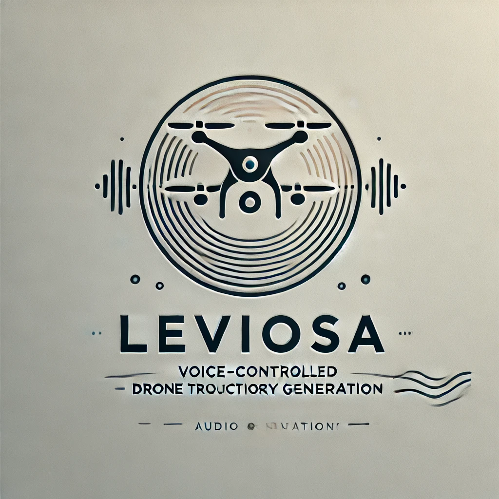

# Leviosa



Speech To Trajectory Using Large Large Models

## Journal Paper To Do List
These are the articles that we will be modeling our paper after:
https://arxiv.org/pdf/2310.11604\
https://arxiv.org/pdf/2406.09640

- [ ] Abstract (Godwyll Aikins)
- [ ] Introduction (Godwyll Aikins)
- [ ] Related Work (Godwyll Aikins)
- [ ] Problem Formulation and Framework (Pascal)
- [ ] Control (Godwyll)
- [ ] Prompt Development (Pascal)
- [ ] Prompt Ablation including speech to text ablation (Josias)
- [ ] *Prompt (Involving images from simulation) (Josias)
- [ ] Conclusion (Godwyll)


## Installation

```bash
pip install -r requirements.txt
```

## Usage

- testing the speech to text component

```bash
python sources/speech_to_text/test.py
```

[//]: # (Working document)
Working doc for the project:
https://docs.google.com/document/d/1Cp56aROa_0yHiElqR8J_LUv6klXoQe8H9EVGXPb528E/edit#heading=h.up3kjmjdvohx


